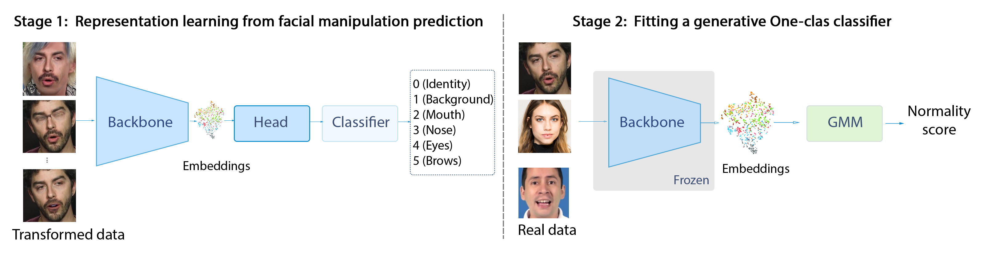

# [UNTAG: Learning Generic Features for Unsupervised Type-agnostic Deepfake Detection](https://ieeexplore.ieee.org/document/10095983)

Pipeline image from the UNTAG paper

Official PyTorch implementation of ["UNTAG: A Two Stage Framework For
Unsupervised Type-Agnostic Deepfake Detection"](https://ieeexplore.ieee.org/document/10095983)

Official uni repo: https://gitlab.uni.lu/phd-nesryne/practical-part/untag-final/-/tree/master/ 


### Setup
First clone the repository and use `environment.yml` to setup a conda virtual environment.
```
$ git clone git@github.com:nesrnesr/UNTAG.git
$ cd UNTAG
$ conda env create -f environment.yml
```

### Pretext task training
Run `train_stage_one.py` to train the spliced regions prediction model on an offline-generated dataset.

The command to run is 
```
$ python train_stage_one.py --log_dir_name pretext_task --dataset_path ./data/stage_one/original_real_data --augmented_dataset_path ./data/stage_one/spliced_data --num_class 6  --pretrained True  --num_epochs 2 --batch_size 32 --learning_rate 0.00003  --freeze_layers True --data_augmentation_type basic --manipulation_type 6transforms
```


### Downstream task
To fit the Gaussian Mixture Model run the following using the weights of epoch 1 of the pretext task:
```
$ python stage_two.py --checkpoint ./tb_logs/pretext_task/version_1/checkpoints/weights.ckpt --data ./data/stage_two_data --num_classes 6 --exp_name exp_on_cdf --df_type cdf 
```
